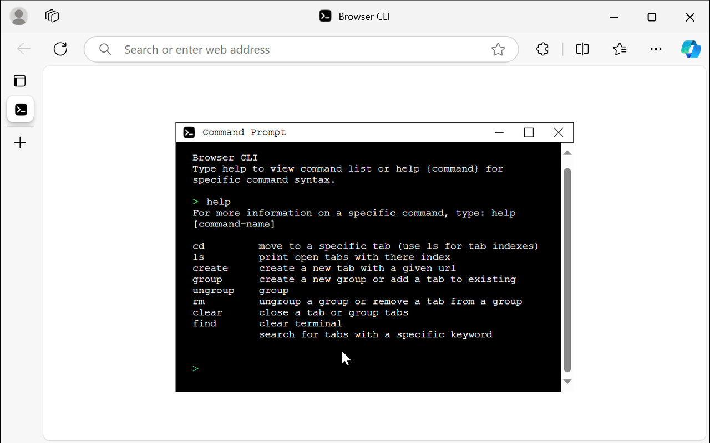
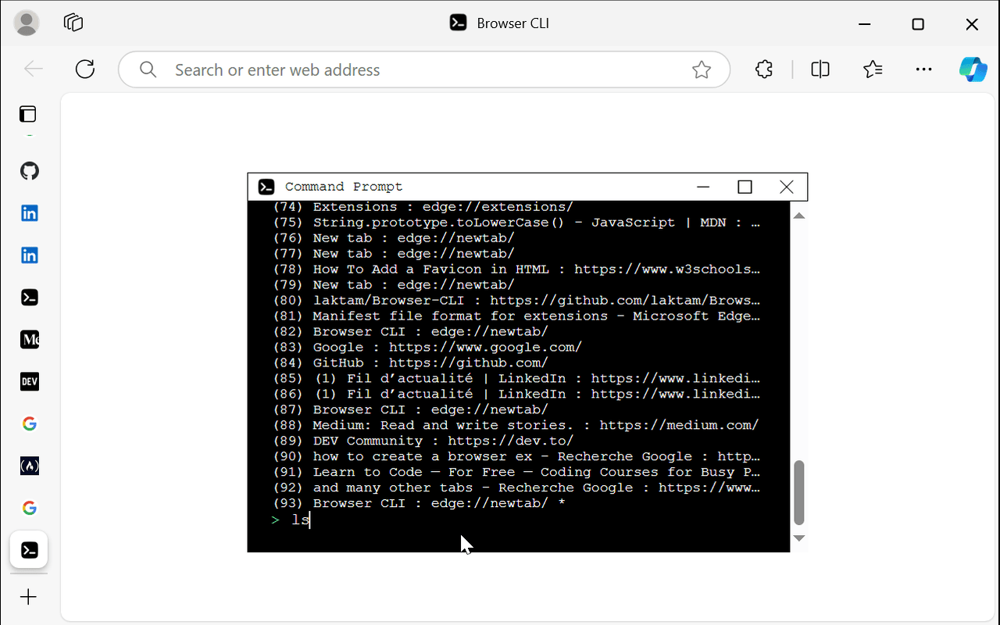
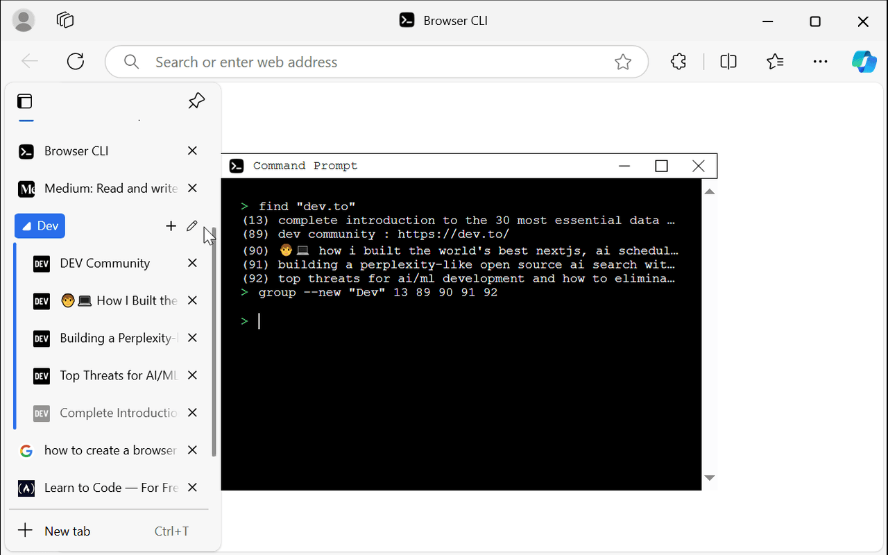

# Browser CLI chrome extension
A CLI for the browser to effortlessly manage tabs and groups. Perfect for tab hoarders

## Commands
support linux like commands and other new commands
1. ls : display all tabs
2. pwd : print current tab
3. cd : go to a tab
4. find : find tabs that contain a string
5. clear : clear terminal
6. create : create a tab
7. group : create a new group or add a tab to an existing group
8. ungroup : delete a group (keep tabs) or delete a tab from a group
9. rm : remove a tabs or a group with its tabs

## Exemple
### New version
In this new version the extension change the new tab of the browser whenever a new tab is created the terminal will appear, it's now exactly like a windows termianl.

### Old version
https://github.com/user-attachments/assets/6f942187-2b0c-49d8-b9c1-ddc943ad4c80

