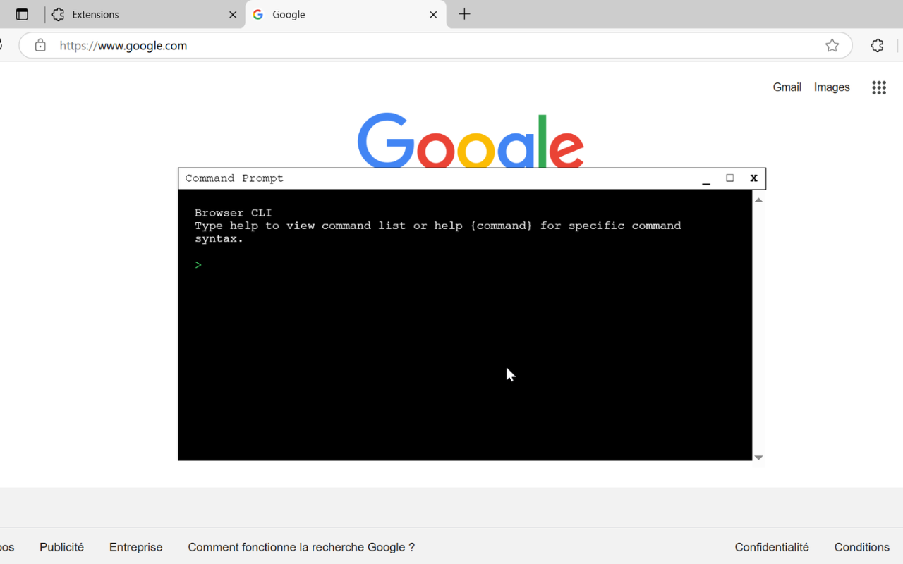
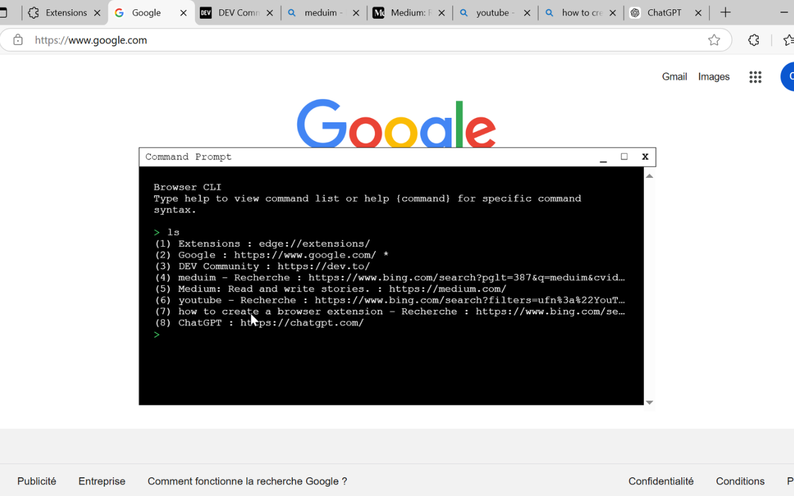
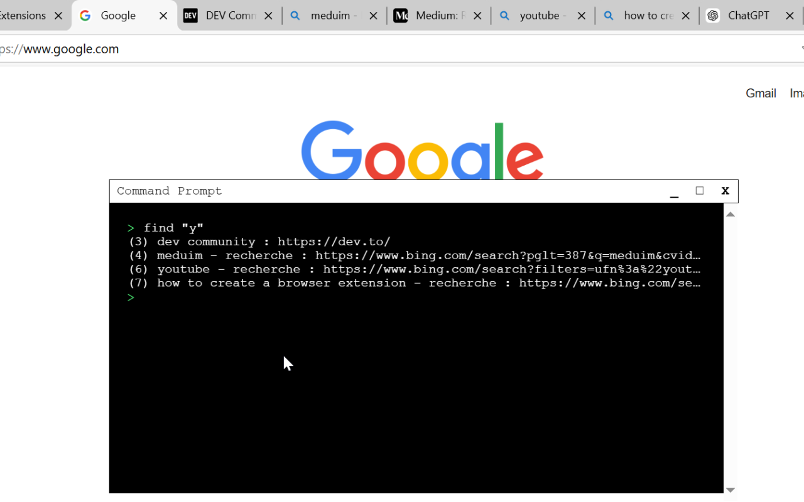
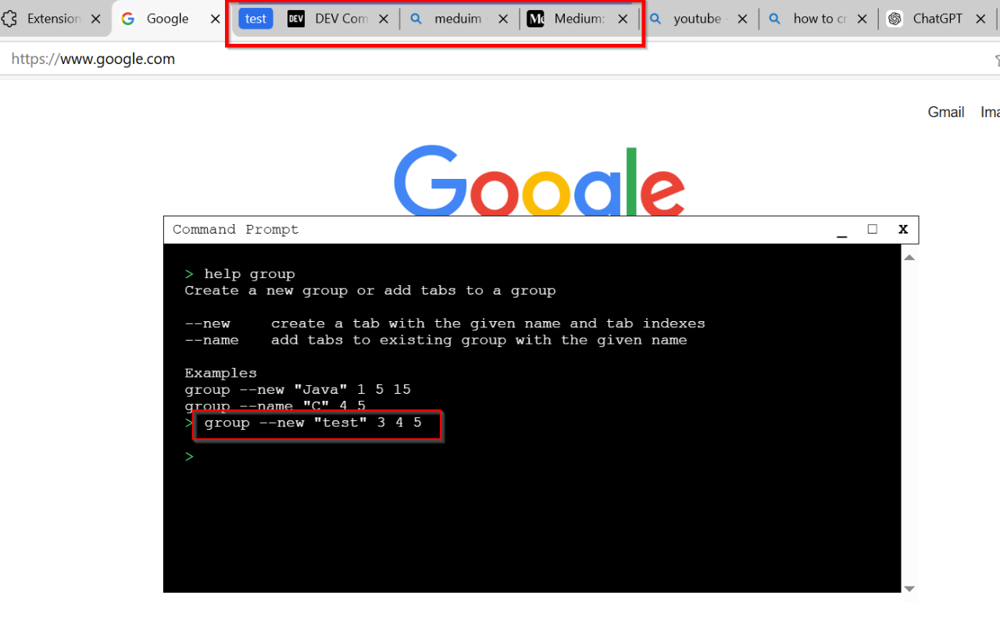
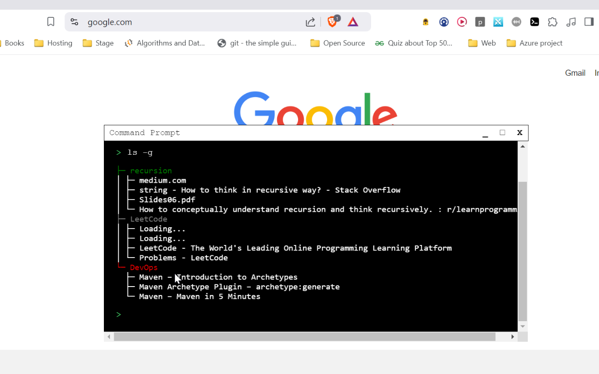

# Browser CLI chrome extension
A CLI for the browser to effortlessly manage tabs and groups. Perfect for tab hoarders

## Commands
supported commands:
1. ls : display all tabs
2. cd : go to a tab
3. find : find tabs that contain a string
4. clear : clear terminal
5. create : create a tab
6. group : create a new group or add a tab to an existing group
7. ungroup : delete a group (keep tabs) or delete a tab from a group
8. rm : remove a tabs or a group with its tabs
9. help : to display commands syntax and usage guide

## Exemple
Click the link in the extension popup page to configure the shortcut
Use the keyboard shortcut to display and hide the terminal in current tab

